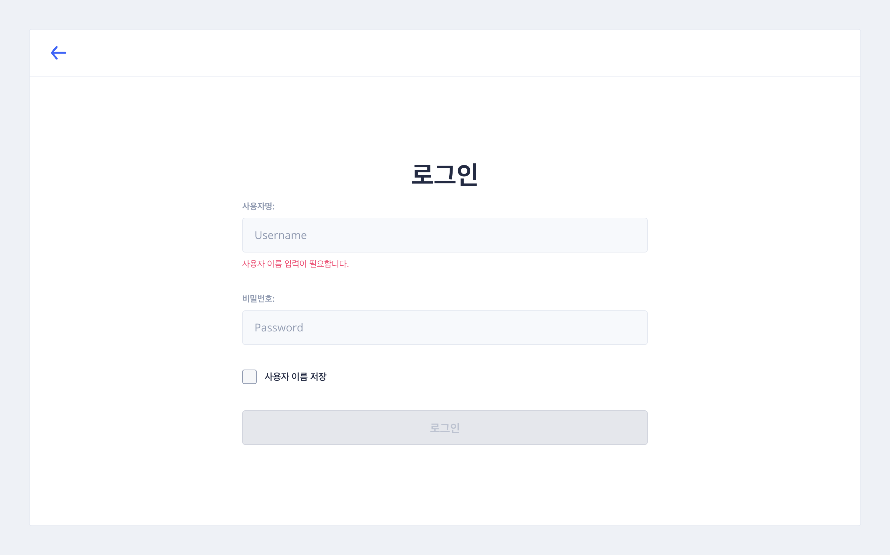

+++
title = "Documents"
type = "docs"
[menu.main]
weight = 1
date = 2023-07-07T11:57:06+09:00
draft = false
+++

## 개요
본 가이드북은 SKPACK 관리자 페이지의 이해를 돕기위해 제작되었습니다.  
가이드북 메뉴의 순서는 관리자 페이지 접속시 보여지는 좌측메뉴의 순서대로 작성이 되었음을 참고 부탁드립니다.
 

## 관리자 페이지 접속하기

|                      관리자 페이지 첫 화면(로그인 화면)                       |                                                설명                                                 |
|:---------------------------------------------------------------:|:-------------------------------------------------------------------------------------------------:|
|  | 1. [SKPACK 관리자 페이지](https://skpack.co.kr/admin/auth/login)에 접속 합니다.   2. 관리자 아이디로 로그인합니다. |

