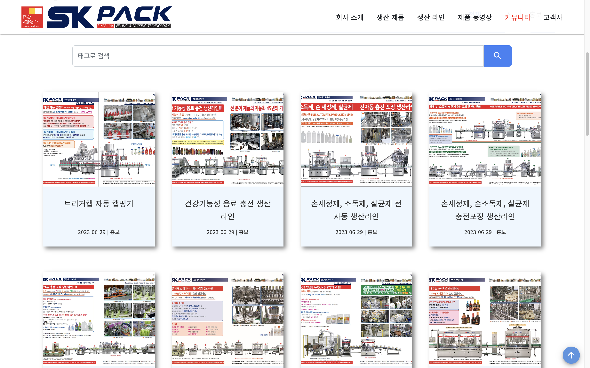
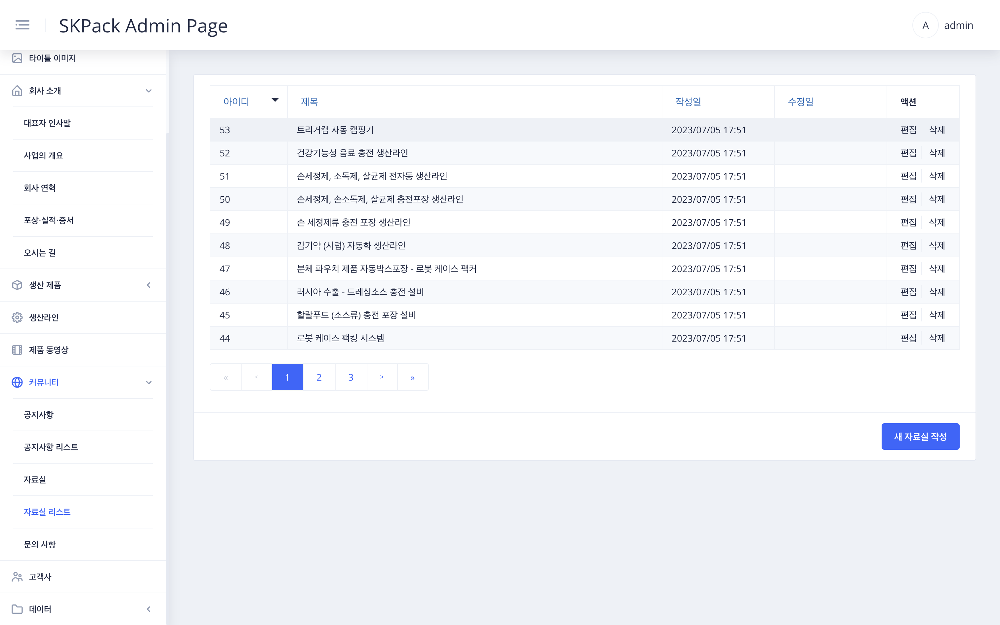
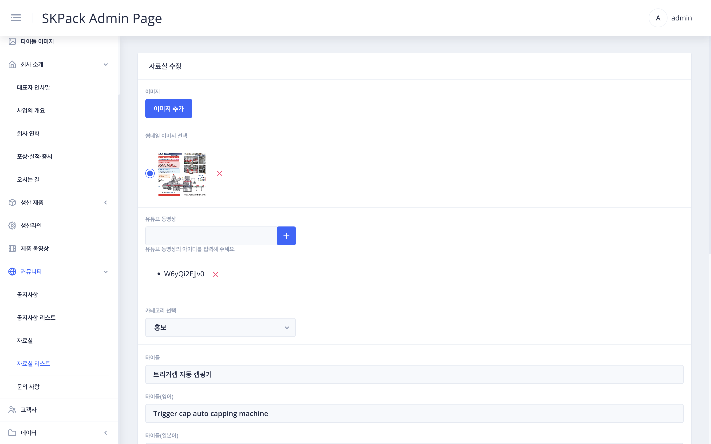
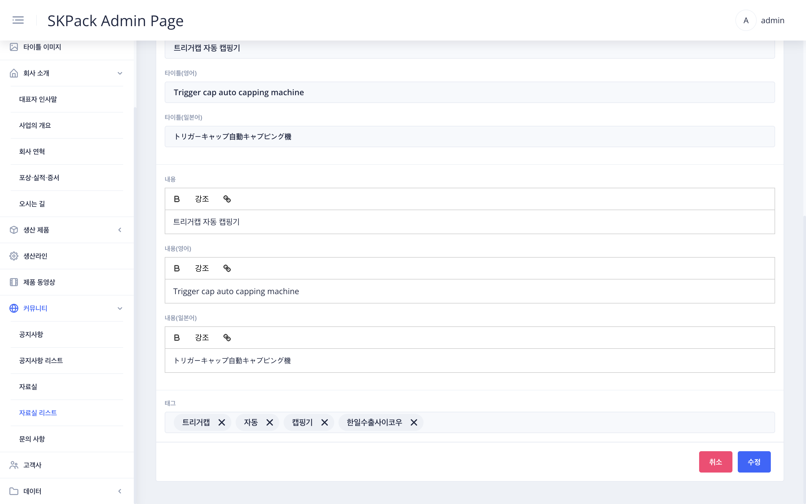

| SKPACK홈페이지 커뮤니티 > 자료실 페이지 카드부분 화면 | 설명 |
  |:---:|:---:|
||<li>SKPACK 홈페이지 자료실페이지의 카드내용 부분입니다.|
| 관리자 페이지 좌측메뉴 > `커뮤니티` > `자료실 리스트` 화면 | 설명 |
||<li>자료실 카드들의 목록이 보여집니다.|
| 편집시: 화면 우측 `편집` / 새 자료실 작성시: 우측 하단 `새 자료실 작성` > 메뉴 수정 화면 | 설명 |
|| 1. 추가할 이미지를 업로드 해주고 이미지중 메인으로 보여줄 썸네일 이미지를 선택합니다.    2. 유튜브 동영상 아이디를 입력하고 `+`버튼을 눌러줍니다.    3. 타이틀 및 내용을 각 언어별로 수정합니다.    4. 태그 검색시 필터링 될 태그 단어를 입력한 후 `수정`(새 자료실 작성시에는 `저장`) 버튼을 눌러 작업을 완료합니다.|

  
