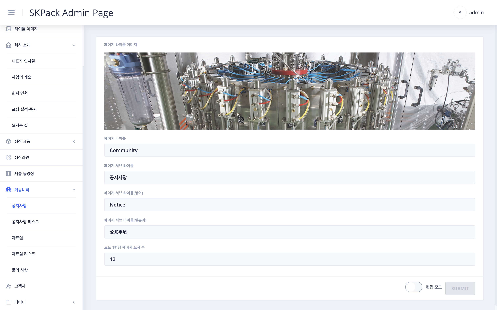

| SKPACK홈페이지 커뮤니티 > 공지사항 페이지 화면 | 설명 |
  |:---:|:---:|
||<li>SKPACK 홈페이지 공지사항 페이지의 수정되는 부분입니다.|
| 관리자 페이지 좌측메뉴 > `커뮤니티` > `공지사항` 화면 | 설명 |
|| 1. 화면 우측 하단 편집 모드의 `슬라이드 버튼`을 클릭하여 편집모드를 활성화 시켜줍니다.    2. 타이틀 이미지 선택(좌측메뉴 `타이틀 이미지`에서 업로드된 이미지)후 타이틀 및 서브타이틀을 언어별로 입력해줍니다.    3. 로드당 페이지 표시 수는 페이지 오픈시 한꺼번에 로드되어 표시해주게 될 카드표시 갯수를 의미합니다. 스크롤다운시 자동으로 나머지 카드들도 로드되어 표시되게 되므로 양에 따라 적정한 갯수를 자유롭게 입력합니다.     4. 작성이 완료되면 우측하단 `SUBMIT` 버튼을 클릭하여 작업을 완료해 줍니다. |

 
 
