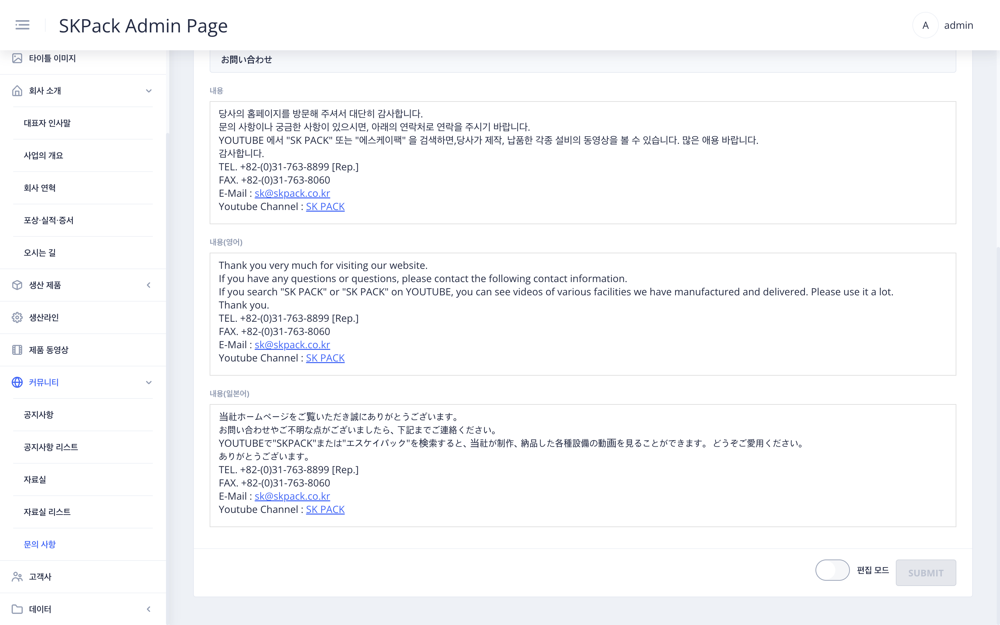

| SKPACK홈페이지 커뮤니티 > 고객문의 페이지 화면 | 설명 |
  |:---:|:---:|
||<li>SKPACK 홈페이지 고객문의 타이틀 및 소개멘트에 해당하는 부분입니다.|
| 관리자 페이지 좌측메뉴 > `커뮤니티` > `문의 사항` 화면 | 설명 |
||1. 화면 우측 하단 편집 모드의 `슬라이드 버튼`을 클릭하여 편집모드를 활성화 시켜줍니다.    2. 페이지 타이틀 이미지 선택(좌측메뉴 `타이틀 이미지`에서 업로드된 이미지) 및 타이틀, 서브타이틀, 내용을 언어별로 작성합니다.    3. 입력이 완료되면 우측하단 `SUBMIT` 버튼을 클릭하여 작업을 완료해 줍니다. |

  