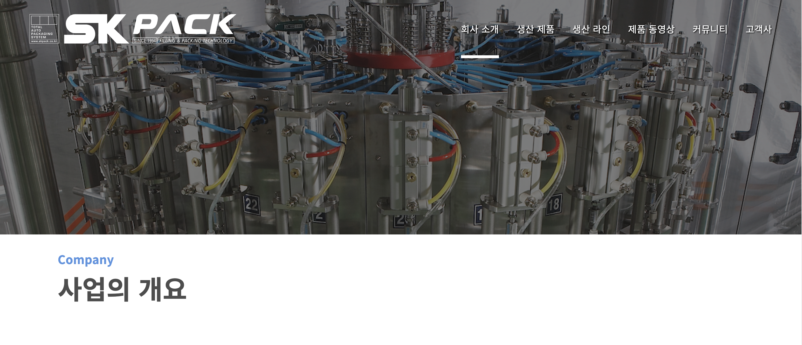
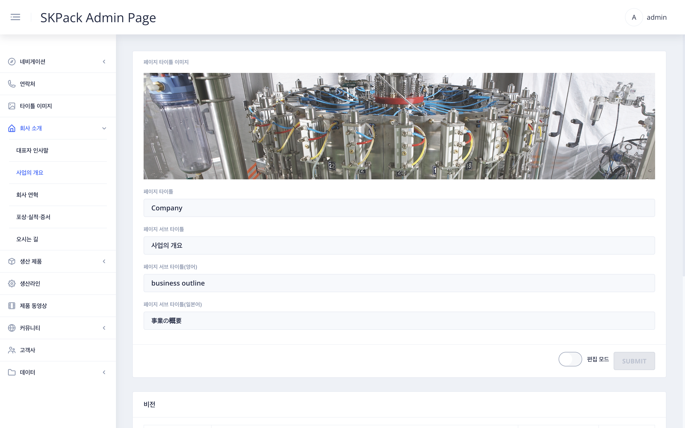
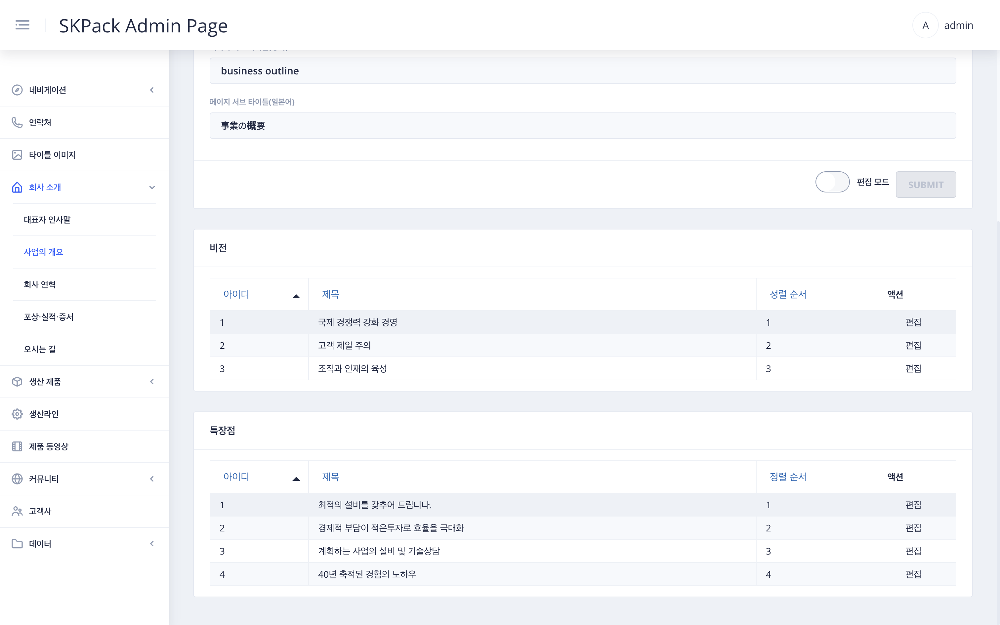
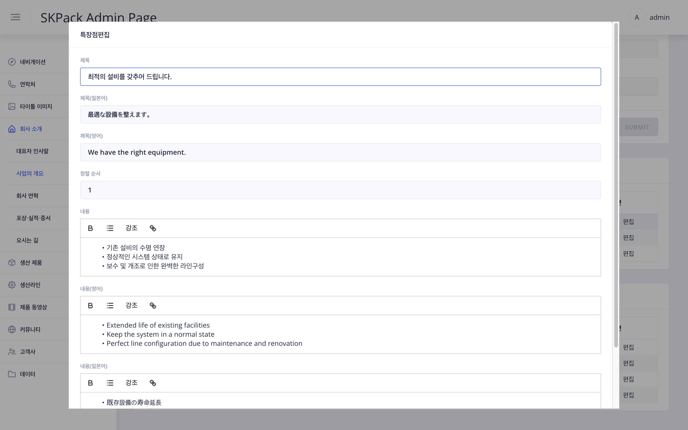
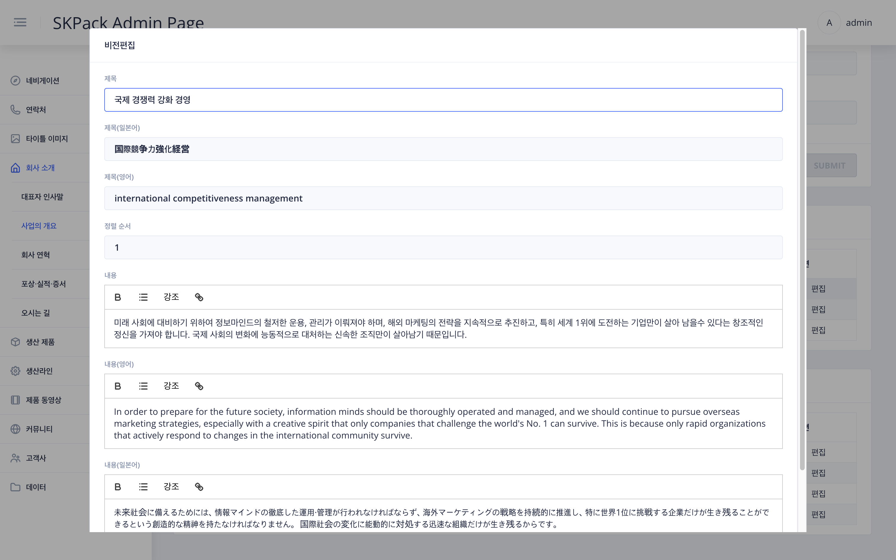

| SKPACK홈페이지 회사소개 > 사업의 개요 | 설명 |
  |:---:|:---:|
||<li>SKPACK 홈페이지 사업의 개요부분입니다. <li> 타이틀 및 비전과 특장점의 내용을 편집/추가할수 있습니다.|
| 타이틀 편집시: 관리자 페이지 좌측메뉴 `회사소개`> `사업의 개요` 화면 | 설명 |
|| 1. 화면 우측 하단 편집 모드의 `슬라이드 버튼`을 클릭하여 편집모드를 활성화 시켜줍니다.    2. 타이틀 이미지 선택(좌측메뉴 `타이틀 이미지`에서 업로드된 이미지) 및 편집할 항목을 수정 후 우측하단 `SUBMIT` 버튼을 클릭하여 작업을 완료해 줍니다. |
| 비전 및 특장점 편집시: 관리자 페이지 좌측메뉴 `회사소개`> `사업의 개요` 하단부 화면 | 설명 |
|| 1. 비전 및 특장점의 편집할 항목의 우측 `편집` 버튼을 클릭합니다.    2. 편집 할 항목을 각 언어별로 제목과 내용, 정렬순서를 편집합니다.    3. `적용` 버튼을 눌러 편집을 완료합니다.|

  