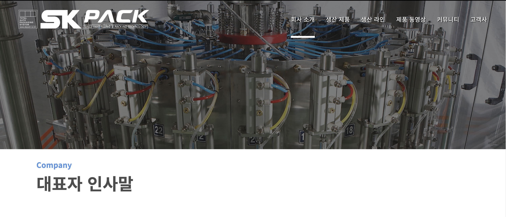
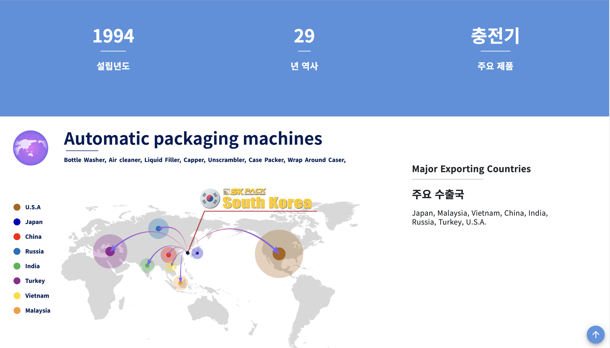
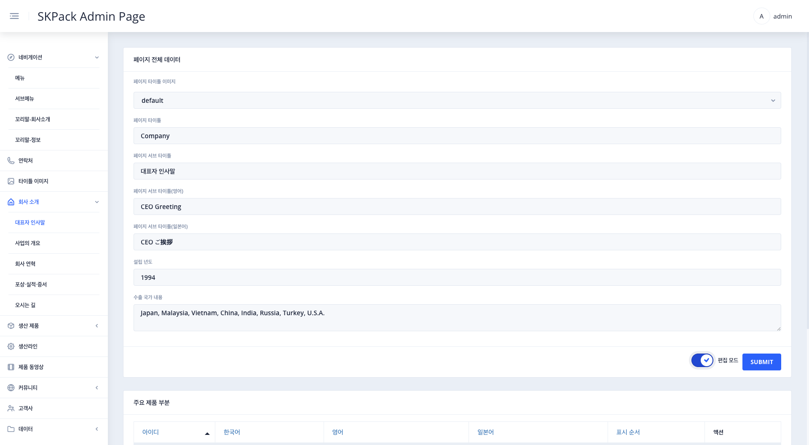
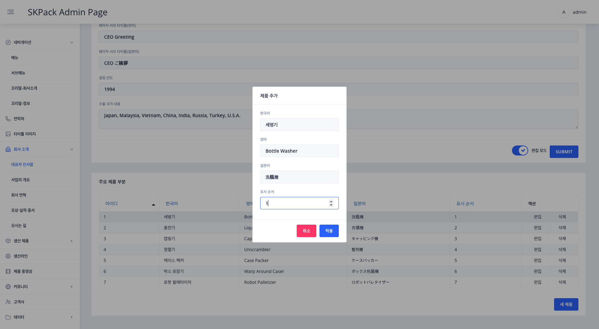
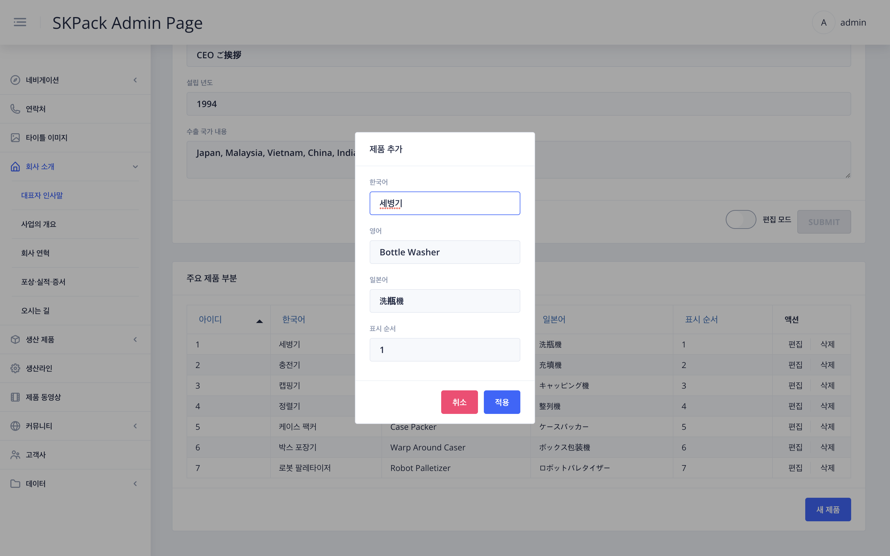

| SKPACK홈페이지 회사소개 > 대표자 인사말 | 설명 |
  |:---:|:---:|
||<li>SKPACK 홈페이지의 대표자 인사말페이지 부분입니다. <li> SKPACK 홈페이지의 실제 수정되는 부분의 이미지 입니다.|
| 편집시: 관리자 페이지 좌측메뉴 `회사소개`> `대표자 인사말` 화면 | 설명 |
|| 1. 화면 우측 하단 편집 모드의 `슬라이드 버튼`을 클릭하여 편집모드를 활성화 시켜줍니다.    2. 타이틀 이미지 선택(좌측메뉴 `타이틀 이미지`에서 업로드된 이미지) 및 편집할 항목을 수정 후 우측하단 `SUBMIT` 버튼을 클릭하여 작업을 완료해 줍니다.    3. 아래로 스크롤바를 내려 주요 제품 부분(홈페이지의 조직도와 지도사이의 실시간으로 변경되는 주요제품부분)의 편집할 우측 편집을 눌러 해당 제품을 각언어 및 표시될 순서를 선택 후 적용버튼을 눌러 작업을 완료해 줍니다.|
| 새 제품 추가시: 화면 우측 하단 `새 제품` > 제품 추가 화면 | 설명 |
|| 1. 추가할 제품을 각언어 및 표시될 순서를 선택 후 적용버튼을 눌러 작업을 완료해 줍니다.|

  