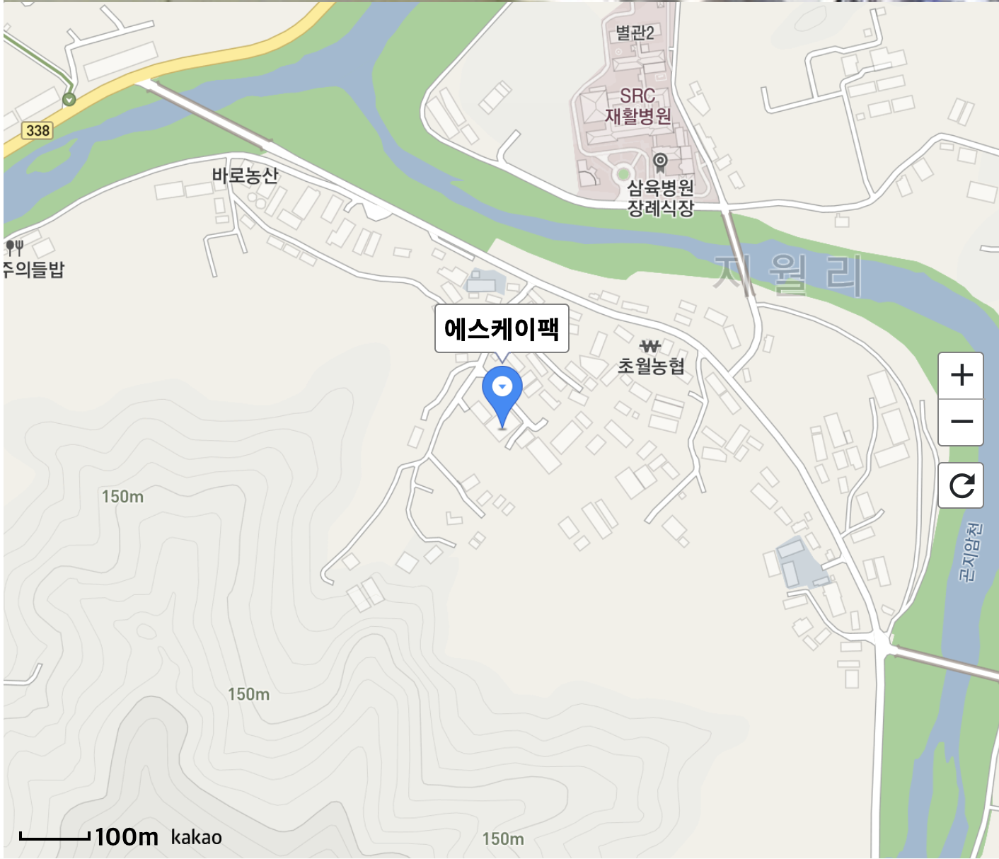
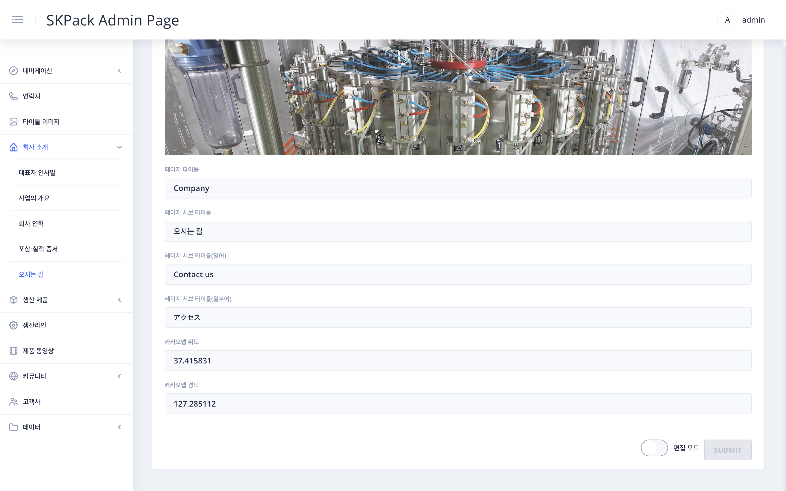

| SKPACK홈페이지 회사 소개 > 오시는길 | 설명 |
  |:---:|:---:|
||<li>SKPACK 홈페이지 오시는 길 페이지 입니다. <li> 타이틀 부분과 지도상의 위치를 변경할 수 있습니다. |
| 관리자 페이지 좌측메뉴 > `회사 소개` > `오시는 길` 화면 | 설명 |
|| 1. 화면 우측 하단 편집 모드의 `슬라이드 버튼`을 클릭하여 편집모드를 활성화 시켜줍니다.    2. 타이틀 이미지 선택(좌측메뉴 타이틀 이미지에서 업로드된 이미지) 및 각언어별 타이틀 지도상 위도와 경도를 수정 후 우측하단 `SUBMIT` 버튼을 클릭하여 작업을 완료해 줍니다. |

