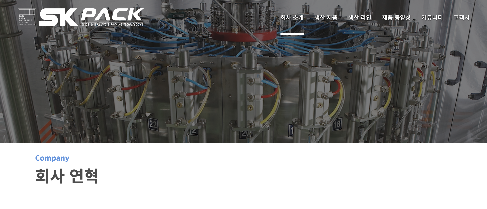

| SKPACK홈페이지 회사소개 > 회사 연혁 | 설명 |
  |:---:|:---:|
||<li>SKPACK 홈페이지 회사연혁 페이지입니다. <li> 타이즐 이미지 및 연혁내용을 편집 할 수 있습니다.|
| 타이틀 편집시: 관리자 페이지 좌측메뉴 > `회사 소개` > `회사 연혁` 화면 | 설명 |
|| 1. 화면 우측 하단 편집 모드의 `슬라이드 버튼`을 클릭하여 편집모드를 활성화 시켜줍니다.    2. 타이틀 이미지 선택(좌측메뉴 `타이틀 이미지`에서 업로드된 이미지) 및 편집할 항목을 수정 후 우측하단 `SUBMIT` 버튼을 클릭하여 작업을 완료해 줍니다. |
| 관리자 페이지 좌측메뉴 > `회사 소개` > `회사 연혁` 하단부 화면 | 설명 |
|| 1. 가장최신의 회사연혁 내용이 연혁목록 상단에 보여집니다.|
| 연혁 편집시: 편집할 항목 우측 `편집` > 메뉴 수정 화면 | 설명 |
|| 1. 수정할 메뉴를 일자 및 각 언어별로 수정합니다.    3. 편집을 완료 후 `적용` 버튼을 눌러 작업을 완료합니다.|
| 연혁 추가시: 화면 우측 하단 `새 항목` > 메뉴 추가 화면 | 설명 |
|| 1. 추가할 메뉴를 일자 및 각 언어별로 추가합니다.    3. 추가를 완료 후 `적용` 버튼을 눌러 작업을 완료합니다.|
  

