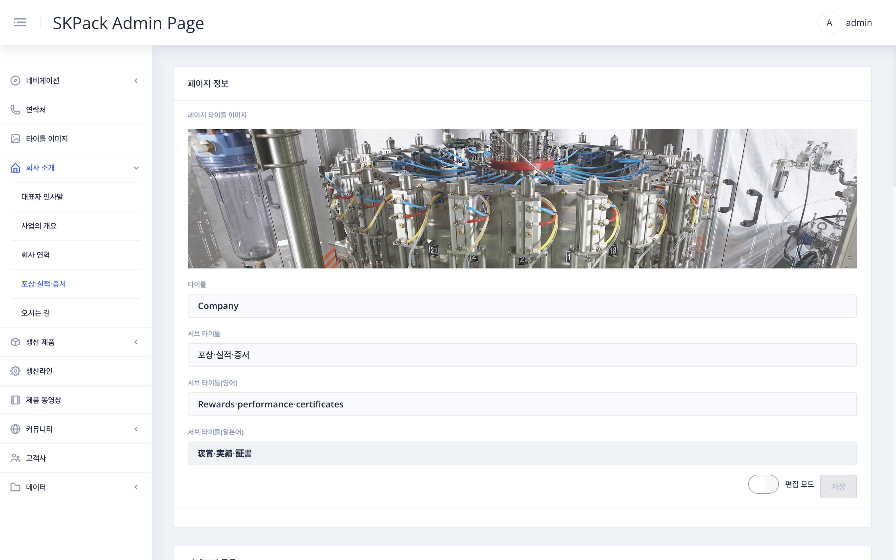
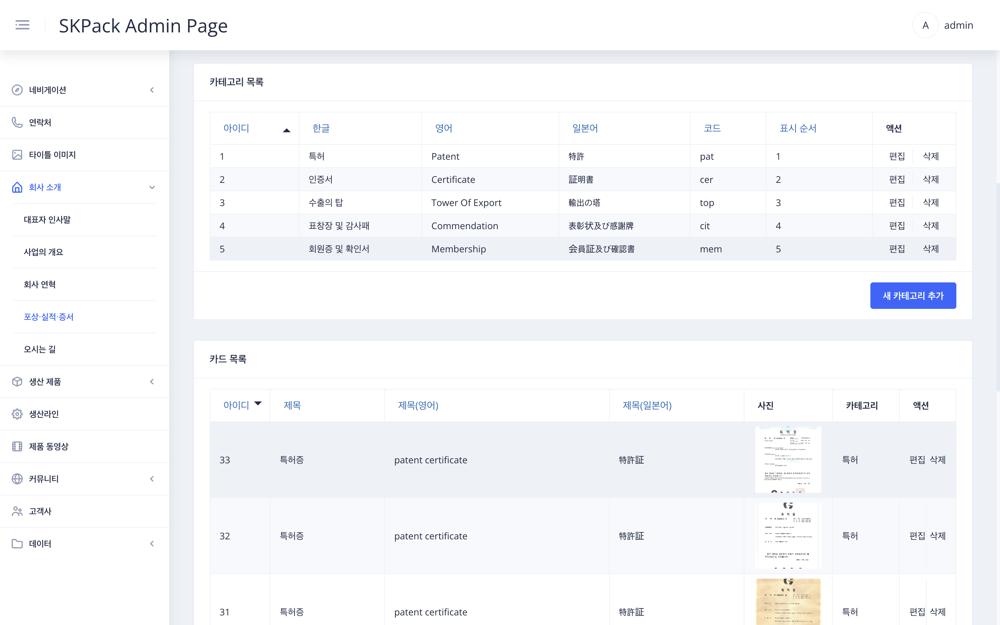
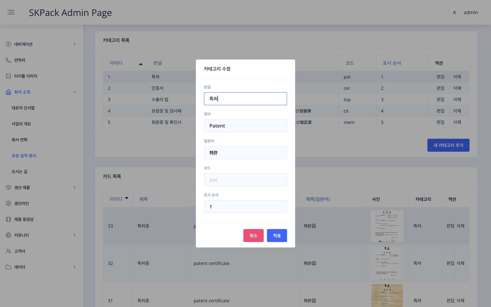
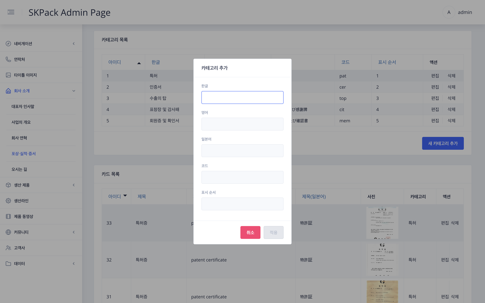
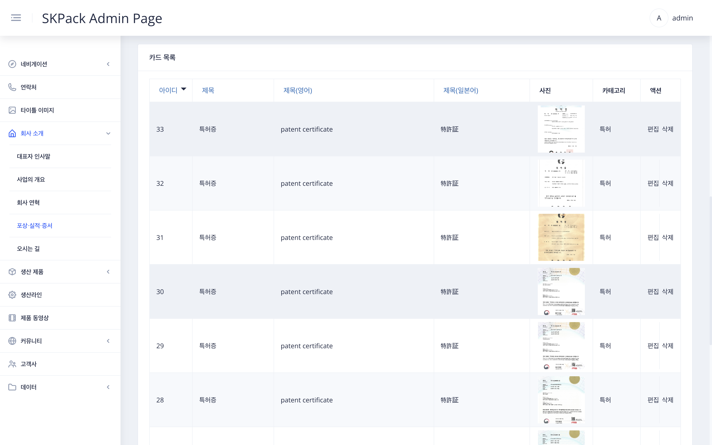
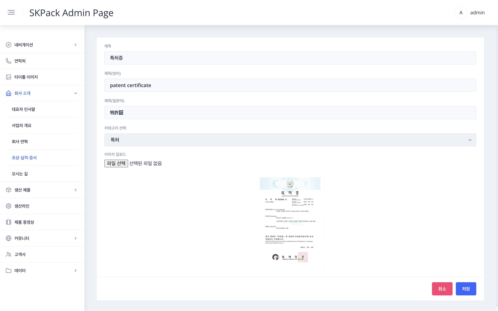

| SKPACK홈페이지 회사 소개 > 포상/실적/증서 페이지 | 설명 |
  |:---:|:---:|
||<li>SKPACK 홈페이지 포상/실적/증서 페이지입니다. <li> 타이틀 및 카테고리 목록 증서등의 카드를 편집할 수 있습니다.|
| 관리자 페이지 좌측메뉴 > `회사 소개` > `포상/실적/증서` 화면 | 설명 |
|| 1. 화면 우측 하단 편집 모드의 `슬라이드 버튼`을 클릭하여 편집모드를 활성화 시켜줍니다.    2. 타이틀 이미지 선택(좌측메뉴 `타이틀 이미지`에서 업로드된 이미지) 및 편집할 항목을 수정 후 우측하단 `SUBMIT` 버튼을 클릭하여 작업을 완료해 줍니다. |
| 관리자 페이지 좌측메뉴 > `회사 소개` > 관리자 페이지 좌측메뉴 > `회사 소개` > `포상/실적/증서` 화면 중간부 화면 | 설명 |
||<li> 홈페이지 포상/실적/증서 페이지의 카테고리 항목들이 보여집니다.|
| 카테고리 목록 편집시: 수정할 카테고리 항목 우측 `편집` > 카테고리 수정 화면 | 설명 |
|| 1. 수정할 항목을 각 언어별로 수정해 줍니다.    2. 수정이 완료되면 `적용` 버튼을 눌러 작업을 완료합니다.|
| 카테고리 목록 추가시: 수정할 카테고리 항목 우측 `편집` > 카테고리 추가 화면 | 설명 |
|| 1. 추가할 항목을 각 언어별로 추가 해 줍니다.    2. 추가가 완료되면 `적용` 버튼을 눌러 작업을 완료합니다.|
| 관리자 페이지 좌측메뉴 > `회사 소개` > 관리자 페이지 좌측메뉴 > `회사 소개` > `포상/실적/증서` 화면 하단부 화면 | 설명 |
|| <li> 홈페이지 포상/실적/증서 페이지의 증서등 카드 항목들이 보여집니다.|
| 카드 추가시: 우측하단 `새 항목 추가`/ 카드 편집시: 편집할 카드 항목 우측 `편집` | 설명 |
|| 1. 카드추가시에는 `새 항목 추가`을 편집시에는 `편집` 버튼을 클릭해줍니다.    2. 추가 및 편집 할 메뉴를 각 언어별로 작성합니다.    3. 업로드할 이미지를 선택 후 `적용` 버튼을 눌러 작업을 완료합니다.|
