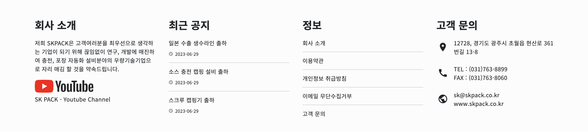
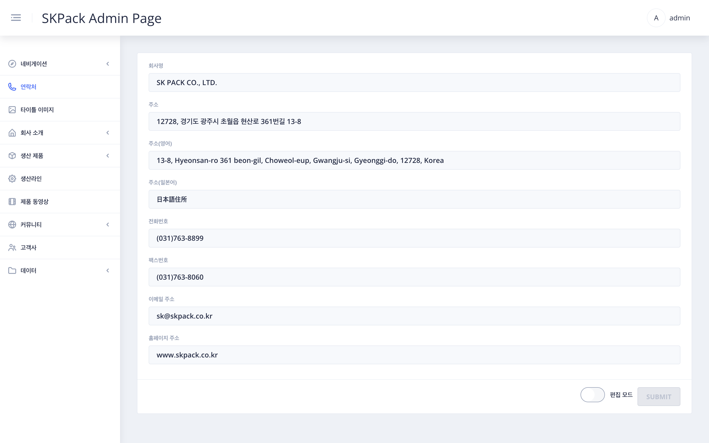

| SKPACK홈페이지 하단우측 고객문의 | 설명 |
  |:---:|:---:|
||<li>SKPACK 홈페이지 하단우측 고객 문의 주소부분입니다. <li> SKPACK 홈페이지의 실제 수정되는 부분의 이미지 입니다.|
| 편집: 관리자 페이지 좌측메뉴 > `연락처` 화면 | 설명 |
||1. 화면 우측 하단 편집 모드의 `슬라이드 버튼`을 클릭하여 편집모드를 활성화 시켜줍니다.    2.주소 편집시 편집할 주소를 한국어, 영어, 일본어별로 편집하여 줍니다.    3. 나머지 수정할 항목이 있다면 수정하여 줍니다.    4. 수정이 완료되면 우측하단 `SUBMIT` 버튼을 클릭하여 작업을 완료해줍니다.|

  
