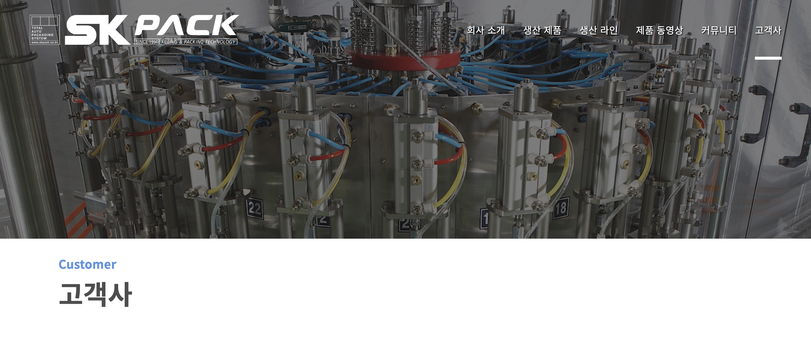
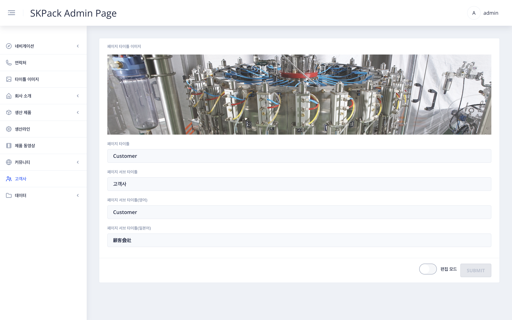

| SKPACK홈페이지 고객사 페이지 화면 | 설명 |
  |:---:|:---:|
||<li>SKPACK 홈페이지 고객사 페이지입니다. 타이틀 상단이미지 및 타이틀 내용을 편집할 수 있습니다.|
| 관리자 페이지 좌측메뉴 > `고객사` 화면 | 설명 |
||1. 화면 우측 하단 편집 모드의 `슬라이드 버튼`을 클릭하여 편집모드를 활성화 시켜줍니다.    2. 페이지 타이틀 이미지 선택(좌측메뉴 `타이틀 이미지`에서 업로드된 이미지) 및 타이틀, 서브타이틀을 언어별로 작성합니다.    3. 입력이 완료되면 우측하단 `SUBMIT` 버튼을 클릭하여 작업을 완료해 줍니다. |
