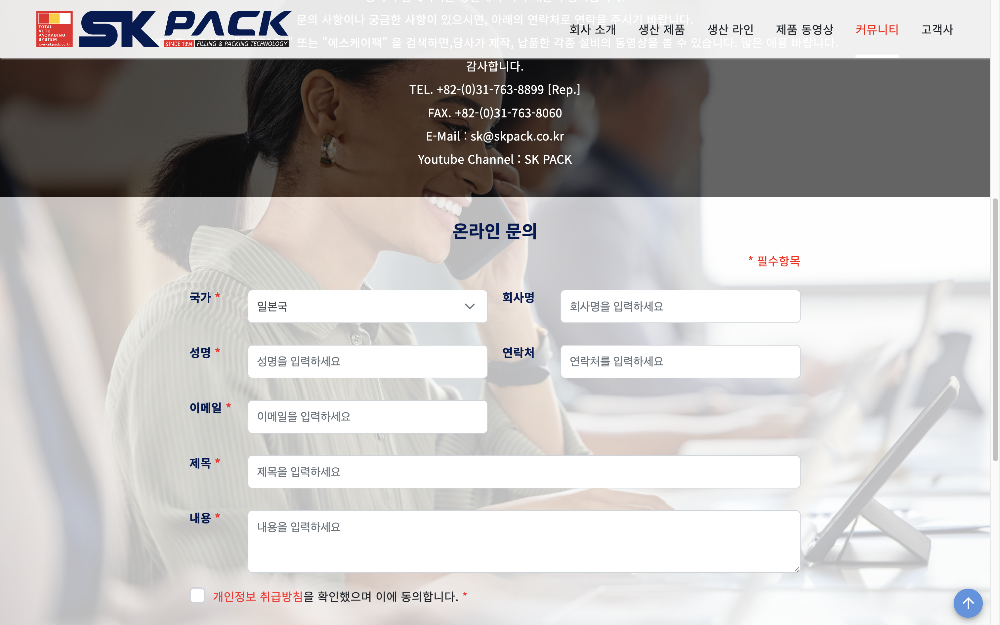
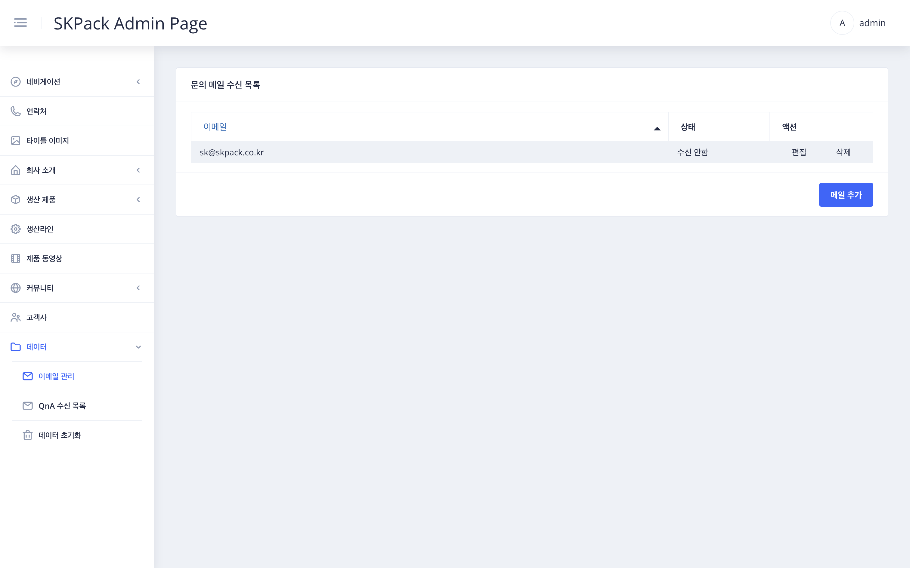
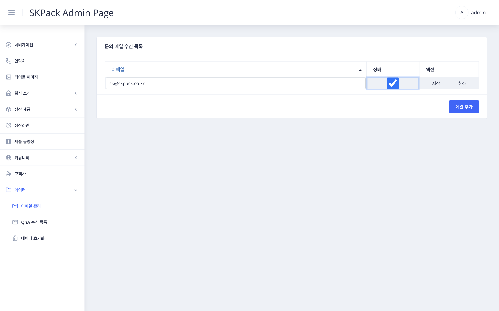

| SKPACK홈페이지 고객문의 페이지 화면 | 설명 |
  |:---:|:---:|
||<li>SKPACK 홈페이지 고객문의 내 고객이 온라인문의시 수신할 메일관리 파트입니다. 데이터코너에서는 실제 외관이 변경되는 부분은 없습니다.|
| 관리자 페이지 좌측메뉴 > `데이터` > `이메일 관리` 화면 | 설명 |
||<li>현재 문의 메일을 수신하고 있는 이메일 및 등록되어있는 메일들이 보여집니다.|
| 편집시: 화면 우측 `편집` / 메일 추가시: 우측 하단 `메일 추가` > 메뉴 수정 화면 | 설명 |
|| 1. 이메일 주소를 수정 및 작성합니다.    2. 상태 체크란에 현재메일로 메일을 수신할 것인지 아닌지를 체크합니다.(수신시에는 `체크`)    3. 우측 액션항목의 `저장` 버튼을 눌러 작업을 완료합니다. 삭제시에는 `삭제`를 눌러줍니다.|

  