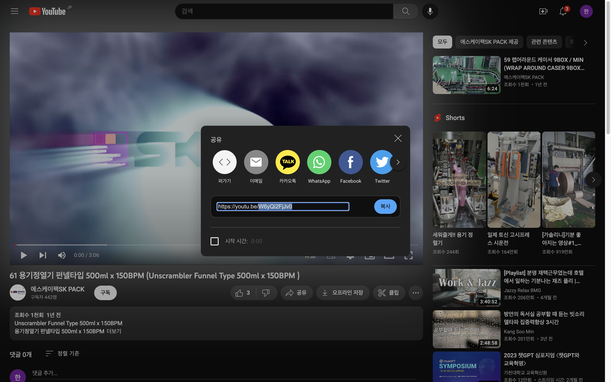

| SKPACK홈페이지 생산라인 페이지 | 설명 |
  |:---:|:---:|
||<li>SKPACK 홈페이지 생산라인 페이지입니다. <li> SKPACK 홈페이지의 실제 수정되는 부분의 이미지 입니다.|
| 관리자 페이지 좌측메뉴 > `생산라인` 화면 | 설명 |
||<li>생산라인의 각 항목들이 보여집니다.|
| 편집시: 편집할 항목 우측 `상세` / 추가시: 화면 우측 하단 `새 라인` | 설명 |
|| 1. 편집할 항목의 우측 `상세` 버튼을 클릭합니다. 라인추가시에는 우측하단 `새 라인`을 클릭합니다.    2. 화면 우측 하단 편집 모드의 `슬라이드 버튼`을 클릭하여 편집모드를 활성화 시켜줍니다.    3. 페이지 가장상단에 들어갈 타이틀 이미지(좌측메뉴 타이틀 이미지에서 업로드된 이미지) 및 라인이미지를 파일선택을 눌러 업로드해 줍니다.    4. 편집할 타이틀(홈페이지 좌측 네비게이션 메뉴가아닌 페이지 배너부분의 타이틀입니다.)과 비디오,(유튜브 아이디)경로(해당페이지 주소창 뒷부분, 편집시에는 편집할경우가 거의없음.),설명문(라인이미지의 아래부분의 설명문입니다.)입력합니다. |   5. 작성이 완료되면 `적용` 버튼을 눌러 작업을 완료합니다.|
| 비디오 항목 추가 설명 (유튜브사이트 화면) | 설명 |
||<li> 비디오 항목: 유튜브사이트에서 등록할 해당 유튜브의 `공유` 버튼클릭시 좌측 이미지처럼 해당영상의 주소 뒷부분(블록된 부분: 유튜브 아이디)을 관리자페이지 > 생산라인 > 상세 또는 새 라인 > 비디오란에 넣어줍니다. |

  