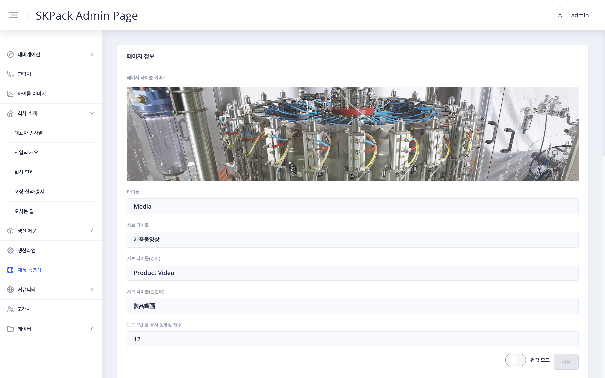
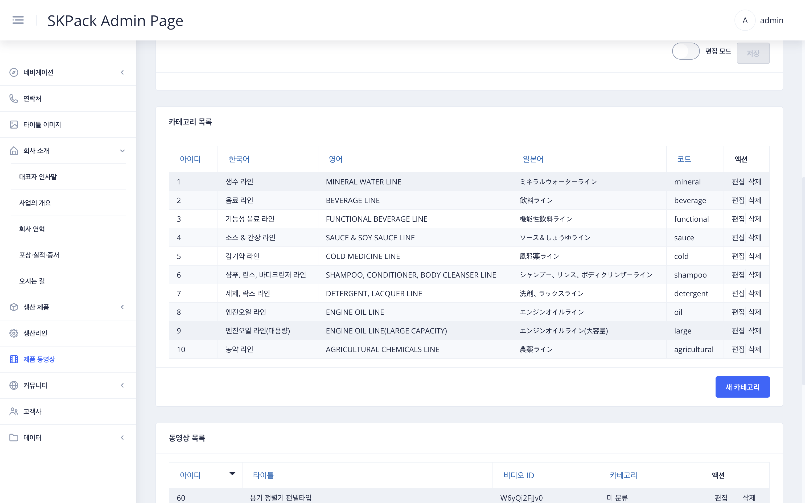
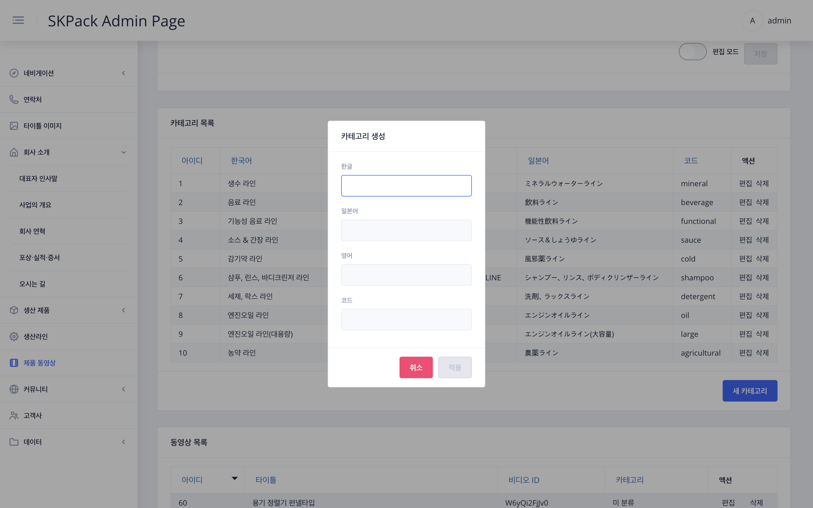
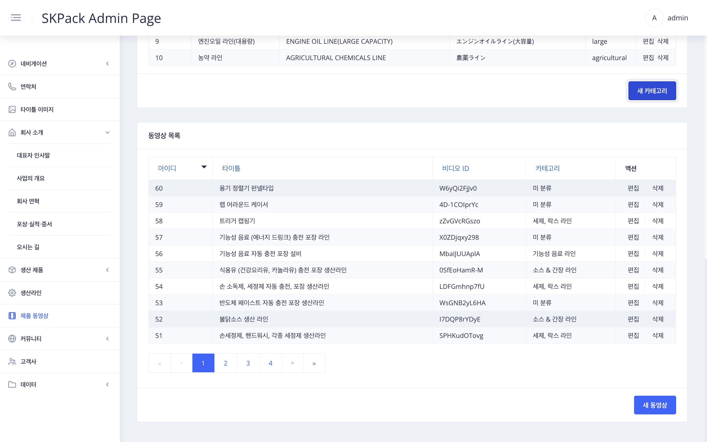
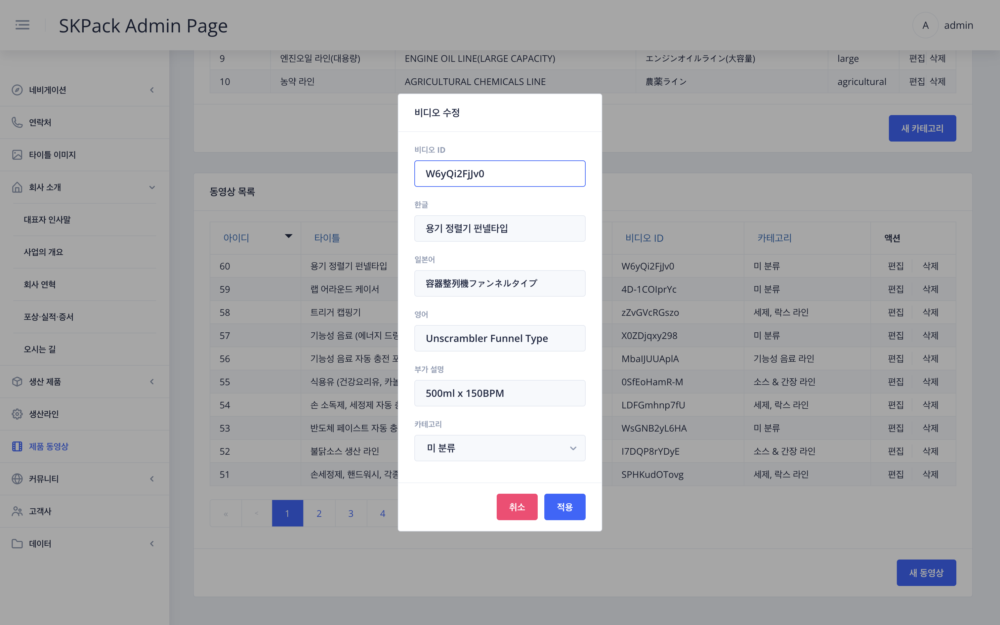
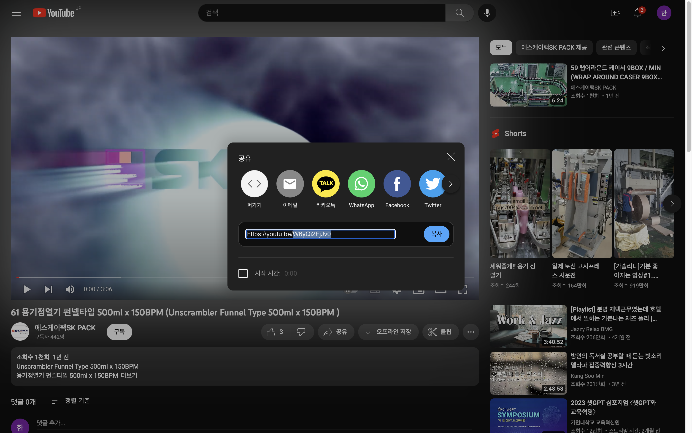
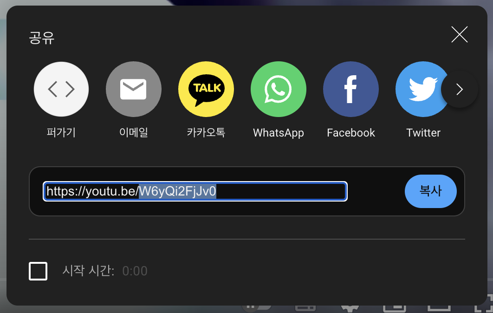

|                                                                                                       SKPACK홈페이지 제품 동영상 화면                                                                                                        |                                                                                                                         설명                                                                                                                          |
  |:----------------------------------------------------------------------------------------------------------------------------------------------------------------------------------------------------------------------------------:|:---------------------------------------------------------------------------------------------------------------------------------------------------------------------------------------------------------------------------------------------------:|
|                                                                                                                                                        |                                                                                       <li>SKPACK 홈페이지 제품 동영상 페이지 입니다. <li> SKPACK 홈페이지의 실제 수정되는 부분의 이미지 입니다.                                                                                        |
|                                                                                                 관리자 페이지 좌측메뉴 > `제품 동영상` 페이지 정보 화면                                                                                                  |                                                                                                                         설명                                                                                                                          |
|                                                                                                                                                        |                                               1. 화면 우측 하단 편집 모드의 `슬라이드 버튼`을 클릭하여 편집모드를 활성화 시켜줍니다.    2. 타이틀 이미지 선택(좌측메뉴 `타이틀 이미지`에서 업로드된 이미지) 및 서브 타이틀을 수정 후 우측하단 `저장` 버튼을 클릭하여 작업을 완료해 줍니다.                                                |
|                                                                                                관리자 페이지 좌측메뉴 > `제품 동영상` > 카테고리 목록 화면                                                                                                |                                                                                                                         설명                                                                                                                          |
|                                                                            | 1. 홈페이지 생산라인페이지의 좌측 사이드메뉴(카테고리 목록) 편집구간입니다. 편집할 항목의 우측 `편집` 버튼을 클릭합니다. 새 카테고리 추가시에는 우측하단 `새 카테고리`를 클릭합니다.    2. 각 언어별로 수정 또는 작성합니다. 새 카테고리 추가시에는 코드부분에 지금까지 사용하지 않은 코드이름(영문으로 작성)을 자유롭게 작성합니다.   3. 작성이 완료되면 `적용` 버튼을 눌러 수정을 완료합니다. |
|                                                                                                관리자 페이지 좌측메뉴 > `제품 동영상` > 동영상 목록 화면                                                                                                 |                                                                                                                         설명                                                                                                                          |
|                                                                            |         1. 홈페이지 생산라인페이지의 영상편집구간입니다. 편집할 항목의 우측 `편집` 버튼을 클릭합니다. 새 동영상 추가시에는 우측하단 `새 동영상`을 클릭합니다.    2. 비디오ID 및 영상제목을 각 언어별로 수정 또는 작성합니다.    4. 영상카드 가장 하단에 들어가 부가 설명을 작성합니다.    5. 카테고리를 선택 후 `적용` 버튼을 눌러 수정을 완료합니다.         |
|                                                                                                     비디오 ID항목 추가 설명 (유튜브사이트 화면)                                                                                                     |                                                                                                                         설명                                                                                                                          |
|  |                                                                        <li> 비디오 ID항목: 유튜브사이트에서 등록할 해당 유튜브의 `공유` 버튼클릭시 좌측 이미지처럼 해당영상의 주소 뒷부분(블록된 부분: 유튜브 아이디)을 비디오ID란에 넣어줍니다.                                                                        |
  
