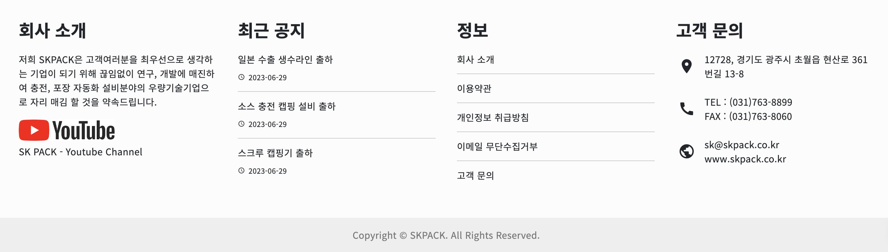
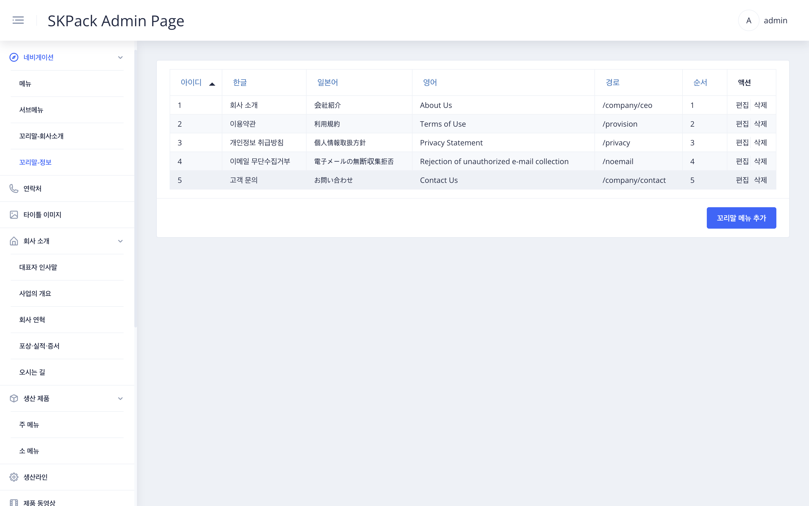
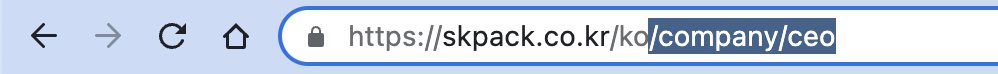
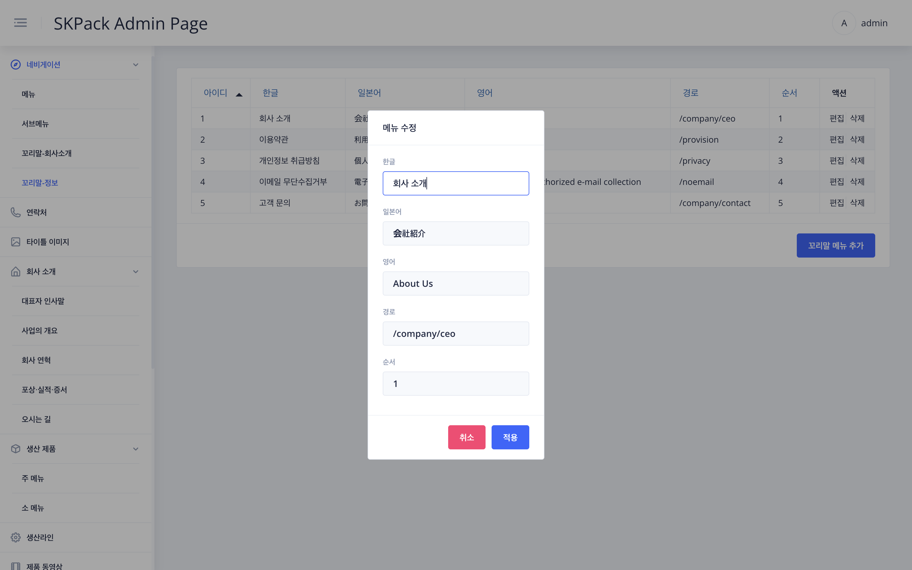

|                                                                       SKPACK홈페이지 하단 꼬리말-정보                                                                       |                                                                                             설명                                                                                              |
  |:----------------------------------------------------------------------------------------------------------------------------------------------------------------:|:-------------------------------------------------------------------------------------------------------------------------------------------------------------------------------------------:|
|                                                                                  |                                                    <li>SKPACK 홈페이지 하단(Footer) 꼬리말-정보 수정 메뉴입니다.<li> SKPACK 홈페이지의 실제 수정되는 이미지 중간 정보 부분입니다.                                                    |
|                                                               관리자 페이지 좌측메뉴 > `네비게이션` > `꼬리말-정보` 화면                                                               |                                                                                             설명                                                                                              |
|  |             꼬리말-정보부분에 해당하는 한글, 일본어, 영어버전이 보여집니다.<li>경로항목은 SKPACK홈페이지상에서 해당타이틀을 클릭시 연결될 페이지(예:좌측하단 이미지)의 주소뒷부분(블록지정한 부분)을 의미합니다.<li>순서항목은 SKPACK홈페이지상의 위에서부터 아래로 보여지는 메뉴 순서입니다.              |
|                                                                  편집시: 수정할 항목 우측 `편집` > 메뉴 수정 화면                                                                  |                                                                                             설명                                                                                              |
|                                                                                  |                                                              1. 수정할 항목을 수정해 줍니다.    2. 수정이 완료되면 `적용` 버튼을 눌러 작업을 완료합니다.                                                              |
|                                                             메뉴 추가시: 화면 우측 하단 `꼬리말 메뉴 추가` > 메뉴 추가 화면                                                              |                                                                                             설명                                                                                              |
|                                                                                  | 1. 추가 할 메뉴를 언어별로 작성합니다.    2. 경로는 해당타이틀을 클릭시 연결될 페이지(예:좌측하단 이미지)의 주소뒷부분(블록지정한 부분)을 경로에 입력해 줍니다.    4. 보여질 위에서부터의 순서를 선택해 줍니다.    5. 추가가 완료되면 `적용` 버튼을 눌러 작업을 완료합니다. |
