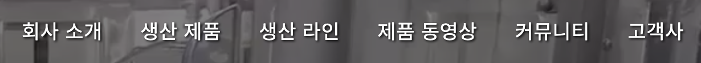
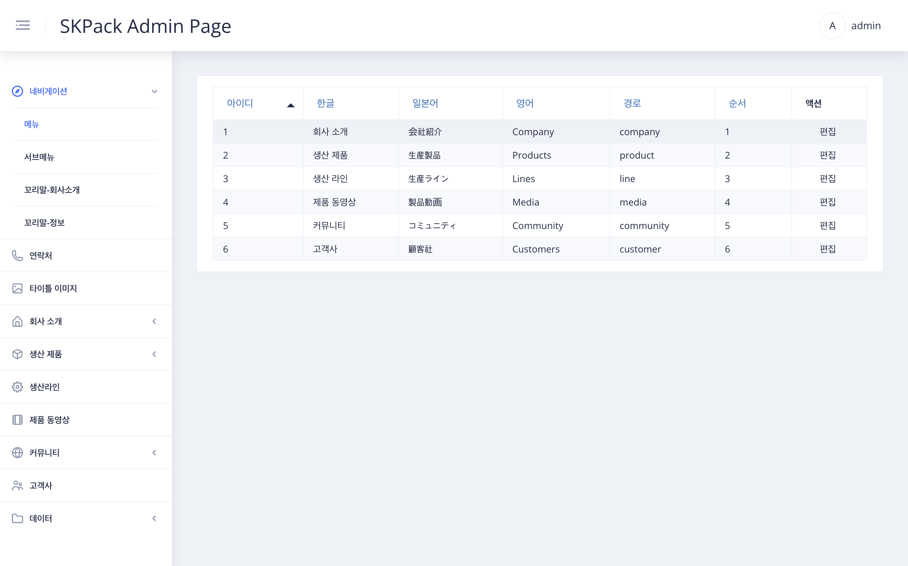
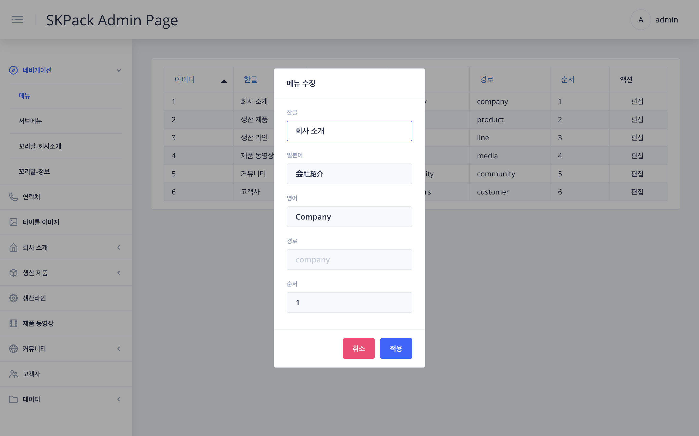

|                                SKPACK홈페이지 상단 메뉴바                                 |                                                  설명                                                  |
|:--------------------------------------------------------------------------------:|:----------------------------------------------------------------------------------------------------:|
|   |                <li>SKPACK 홈페이지 상단메뉴바 수정 메뉴입니다. <li> SKPACK 홈페이지의 실제 수정되는 부분의 이미지 입니다.                |
|                         관리자 페이지 좌측메뉴 > `네비게이션` > `메뉴` 화면                         |                                                  설명                                                  |
|       |                       <li>각 언어별로 편집이 가능합니다.<li>순서란은 홈페이지에 보여지는 좌측부터의 메뉴순서 입니다.                       |
|                              화면 우측 `편집` > 메뉴 수정 화면                               |                                                  설명                                                  |
|       | 1. 편집할 행의 우측 `편집` 버튼을 클릭합니다.    2. 각 언어별 메뉴를 수정합니다.    3. 메뉴순서를 정한 후 `적용` 버튼을 눌러줍니다. |
