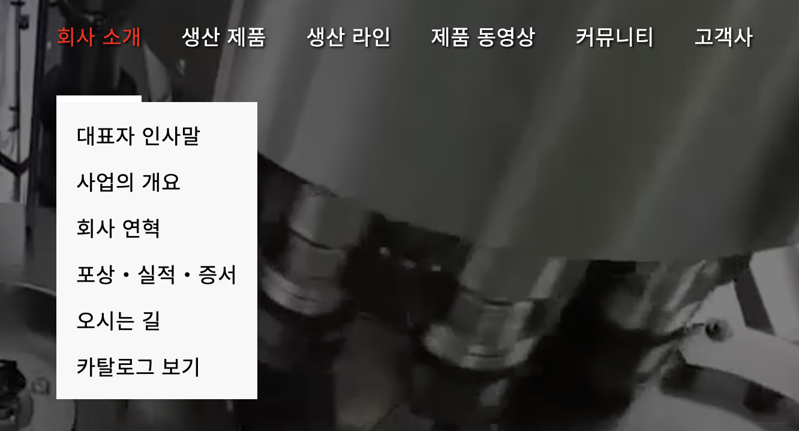
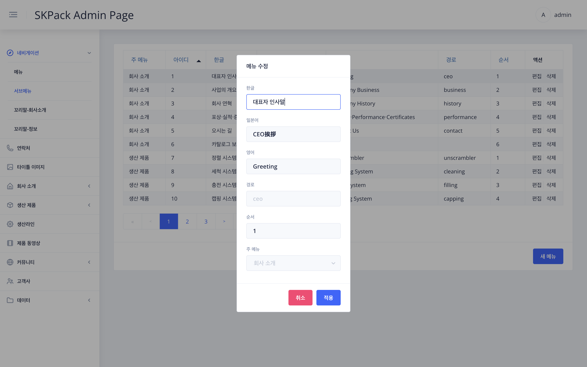
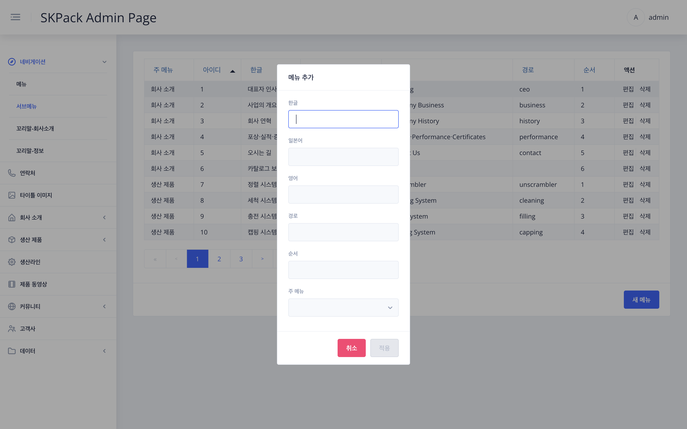

|                            SKPACK홈페이지 상단 서브메뉴(하위메뉴)                             |                                                                                                                                                               설명                                                                                                                                                               |
  |:-------------------------------------------------------------------------------:|:------------------------------------------------------------------------------------------------------------------------------------------------------------------------------------------------------------------------------------------------------------------------------------------------------------------------------:|
|  |                                                                                                                                         <li>SKPACK 홈페이지 메인메뉴의 마우스 오버시 보여지는 하위메뉴 부분입니다.                                                                                                                                         |
|                       관리자 페이지 좌측메뉴 > `네비게이션` > `서브메뉴` 화면                        |                                                                                                                                                               설명                                                                                                                                                               |
|  |                                                                                           <li>서브메뉴가 속해있는 주메뉴가 보여집니다.<li>서브메뉴 타이틀인 한글, 일본어, 영어버전이 보여집니다.<li>순서란은 홈페이지의 마우스 오버시 보여지는 위에서부터 아래로의 서브메뉴 순서입니다.<li>수정할 항목의 우측 편집버튼을 클릭합니다.                                                                                           |
|                         편집시: 수정할 항목 우측 `편집` > 메뉴 수정 화면                          |                                                                                                                                                               설명                                                                                                                                                               |
|  |                                                                                                                               1. 수정할 항목을 수정해 줍니다.    2. 수정이 완료되면 `적용` 버튼을 눌러 작업을 완료합니다.                                                                                                                                |
|                        메뉴추가시: 화면 우측 하단 `새메뉴` > 메뉴 추가 화면                         |                                                                                                                                                               설명                                                                                                                                                               |
|  | 1. 우측하단의 `새메뉴` 버튼을 클릭합니다.    2. 추가 할 메뉴를 언어별로 작성합니다.    3. 경로는 지금까지 사용하지 않은 경로이름으로 자유롭게 영어로 입력해줍니다. (추가한 메뉴가 실제로 추가한 해당 페이지와 연결될때 이 경로를 사용하게됩니다. 해당페이지 추가는 관리자 생산제품과 생산라인 메뉴에서 추가하게 됩니다.)    4. 경로를 입력하고 순서를 선택한 뒤 추가하게 될 새 서브메뉴를 생산제품과 생산라인 중에 선택해 줍니다.    5. 추가가 완료되면 `적용` 버튼을 눌러 작업을 완료합니다. |

  
