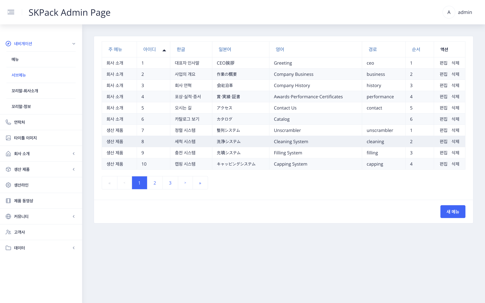

|                               SKPACK홈페이지 상단 서브메뉴바                                |                                                                   설명                                                                   |
|:--------------------------------------------------------------------------------:|:--------------------------------------------------------------------------------------------------------------------------------------:|
|  |                               <li>SKPACK 홈페이지 세로열 서브메뉴바 수정 메뉴입니다. <li> SKPACK 홈페이지의 실제 수정되는 부분의 이미지 입니다.                               |
|                        관리자 페이지 좌측메뉴 > `네비게이션` > `서브메뉴` 화면                        |                                                                   설명                                                                   |
|  |                                      <li>각 언어별로 편집이 가능합니다.<li>순서란은 홈페이지에 보여지는 위에서부터의 서브메뉴 순서입니다.                                       |
|                              화면 우측 `편집` > 메뉴 수정 화면                               |                                                                   설명                                                                   |
|  | 1. 편집할 행의 우측 `편집` 버튼을 클릭합니다.    2. 수정 할 메뉴를 각 언어별로 수정합니다.    3. 순서(홈페이지 서브메뉴 위에서부터의 메뉴순서)를 선택 후 `적용` 버튼을 눌러 수정을 완료합니다. |
|                            화면 우측 하단 `새메뉴` > 메뉴 추가 화면                             |                                                                   설명                                                                   |
|  |       1. 우측하단의 `새메뉴` 버튼을 클릭합니다.    2. 추가 할 메뉴를 각 언어별로 작성합니다.    3. 경로를 입력하고 순서와 주메뉴를 선택 후 `적용` 버튼을 눌러 추가를 완료합니다.       |
