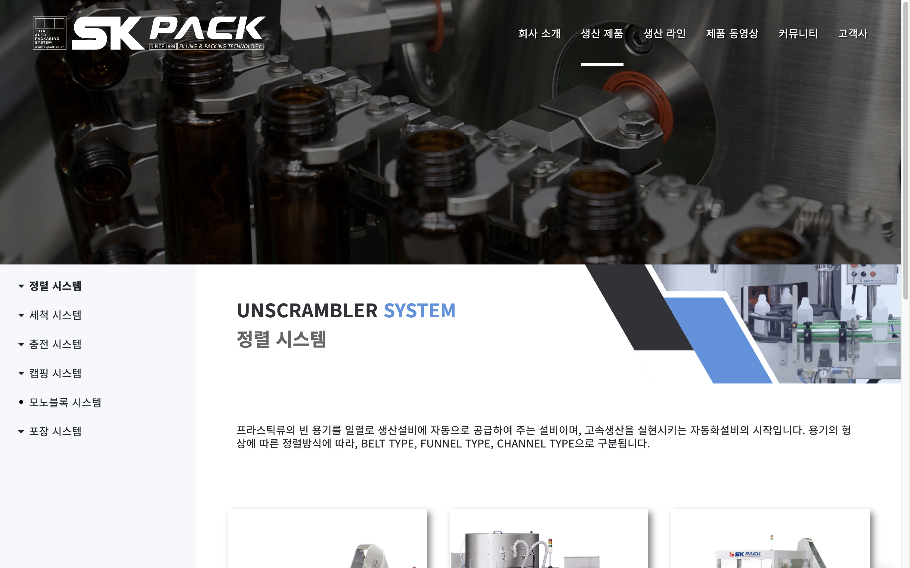
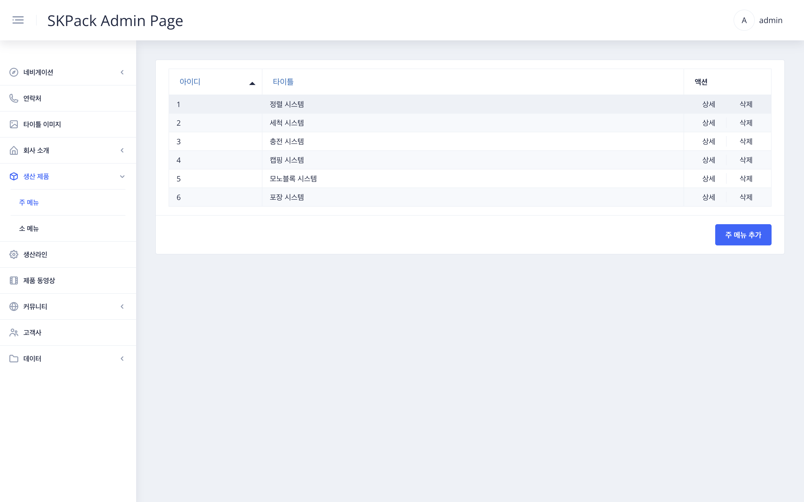
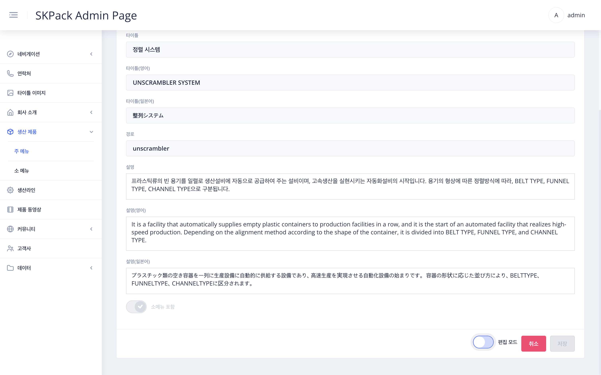
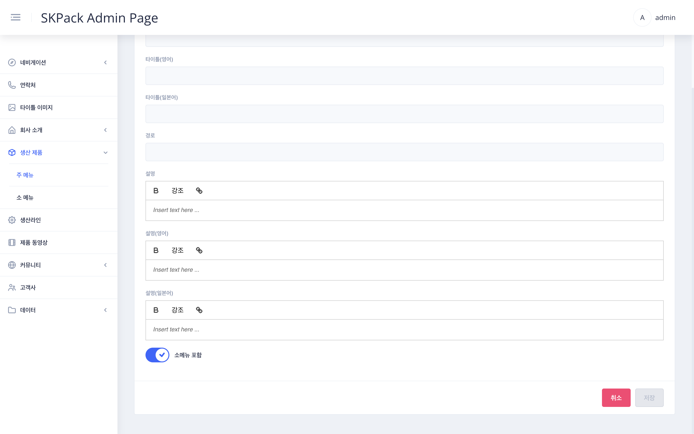

| SKPACK홈페이지 생산제품 페이지 | 설명 |
  |:---:|:---:|
||<li>SKPACK 홈페이지 생산제품페이지의 좌측 주메뉴관련(서브메뉴의 수정은 다음장에 따로 있음)편집 파트입니다.  <li> SKPACK 홈페이지의 실제 수정되는 부분의 이미지 입니다.|
| 관리자 페이지 좌측메뉴 > `생산제품` > `주 메뉴` 화면 | 설명 |
||<li>수정할 메뉴의 우측 상세버튼을 클릭합니다.<li>삭제시에는 해당메뉴 우측 삭제버튼을 눌러 삭제해줍니다.|
| 수정할 항목 우측 `상세` > 메뉴 수정 화면 | 설명 |
|| 1. 화면 우측 하단 편집 모드의 `슬라이드 버튼`을 클릭하여 편집모드를 활성화 시켜줍니다.    2. 타이틀 이미지 선택(좌측메뉴 `타이틀 이미지`에서 업로드된 이미지) 및 편집할 타이틀(홈페이지 좌측 네비게이션 메뉴가아닌 페이지 배너부분의 타이틀입니다.)과 경로(좌측이미지 주소창 뒷부분, 편집시에는 편집할경우가 거의없음.),설명문(홈페이지 주메뉴 클릭시 나오는 타이틀아래의 제품 설명문입니다.)수정합니다. |
| 수정할 항목 우측 `상세` > 메뉴 수정 하단부 화면 | 설명 |
|| 1. 좌측하단의 소메뉴 버튼: 주메뉴의 하위메뉴들을 주메뉴페이지 하단에 카드형식으로 제품을 보여줄경우 "**활성화**"를, 주메뉴페이지에서 한장한장 슬라이드 형식으로 보여줄경우 "**비활성화**"를 시켜줍니다.    2. 작업이 완료되면 `저장` 버튼을 눌러 작업을 완료합니다. 3. 메뉴추가시에는 우측하단의 `주 메뉴 추가`버튼을 클릭하여 편집시와 동일하게 해당항목들을 작성후 `저장`버튼을 눌러 작업을 완료해 줍니다. 추가시 경로는 영문으로 작성하며 기존과 겹치지 않도록 주의해 줍니다.|

  

  

