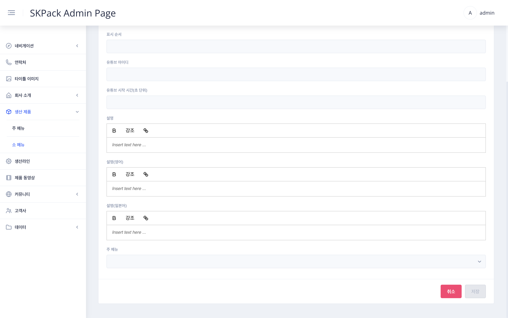

| SKPACK홈페이지 생산제품 > 주 메뉴 > 소 메뉴 화면 | 설명 |
  |:---:|:---:|
||<li>SKPACK 홈페이지 생산제품페이지의 좌측 주메뉴 하위메뉴인 서브메뉴 파트입니다.  <li> SKPACK 홈페이지의 실제 수정되는 부분의 이미지 입니다.|
| 관리자 페이지 좌측메뉴 > `생산제품` > `소 메뉴` 화면 | 설명 |
||<li>소 메뉴의 타이틀과 소 메뉴가 속한 주 메뉴가 보여집니다. <li>편집시에는 해당항목 우측의 `상세` 버튼을 소 메뉴 추가시에는 우측 하단의 `소 메뉴 추가` 버튼을 클릭합니다.|
| 편집시: 편집할 항목 우측 `상세` 화면 | 설명 |
|| 1. 화면 우측 하단 편집 모드의 `슬라이드 버튼`을 클릭하여 편집모드를 활성화 시켜줍니다.    2. 제품페이지 좌측(영상좌측)에 보여줄 이미지파일을 선택 후 제품페이지의 타이틀 항목과 설명문을 각 언어별로 수정해줍니다.    3. 표시순서(소 메뉴 내에서의 보여질 표시순서)를 수정해 줍니다.    4. 유튜브 아이디(영상위치-해당페이지 우측 영상부분): 유튜브사이트에서 등록할 해당 유튜브의 `공유` 버튼클릭시 좌측 이미지처럼 해당영상의 주소 뒷부분(블록된 부분: 유튜브 아이디)을 유튜브 아이디란에 넣어줍니다.    5. 유튜브 시작 시간을 초단위로 입력해 줍니다.(해당시간부터 재생됩니다) 주 메뉴: 어느 주메뉴에 속할 것인지 주 메뉴를 선택해 준 후 `저장` 버튼을 눌러 작업을 완료해 줍니다. |
| 소 메뉴 추가시: 화면 우측 하단 `소 메뉴 추가` 화면 | 설명 |
|| 1. 작성방법은 편집과 동일합니다. 제품페이지 좌측(영상좌측)에 보여줄 이미지파일을 선택 후 제품페이지의 타이틀 항목과 설명문을 각 언어별로 작성해 줍니다.    2. 표시순서(소 메뉴 내에서의 보여질 표시순서)를 작성해 줍니다.    3. 유튜브 아이디: 유튜브사이트에서 등록할 해당 유튜브의 `공유` 버튼클릭시 좌측 이미지처럼 해당영상의 주소 뒷부분(블록된 부분: 유튜브 아이디)을 유튜브 아이디란에 넣어줍니다.    4. 유튜브 시작 시간을 초단위로 입력해 줍니다.(해당시간부터 재생됩니다) 주 메뉴: 어느 주메뉴에 속할 것인지 주 메뉴를 선택해 준 후 `저장` 버튼을 눌러 작업을 완료해 줍니다.|

