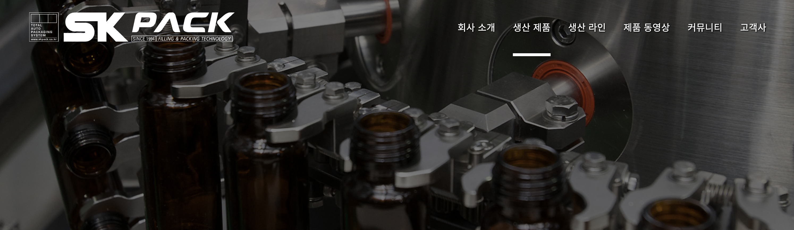
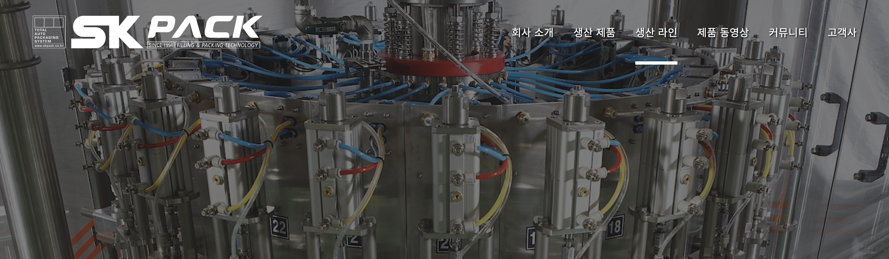
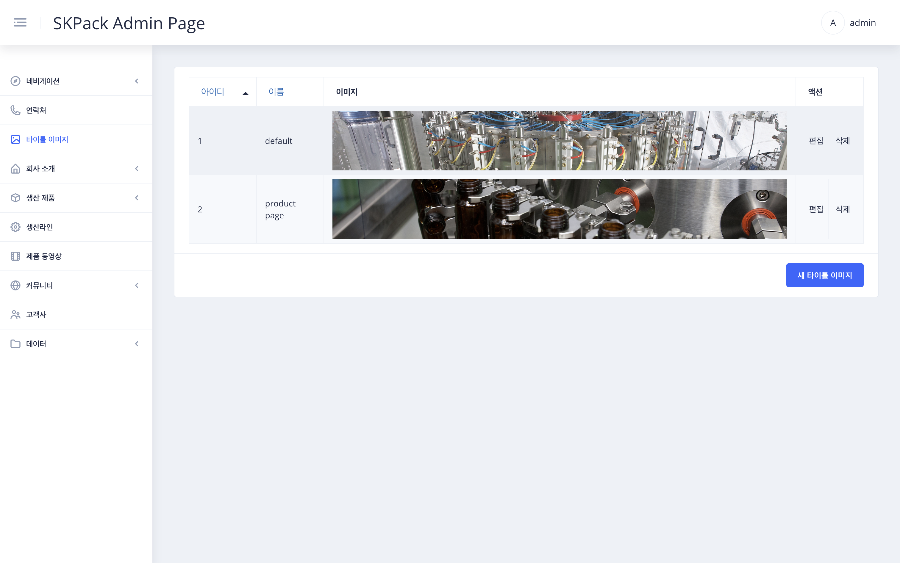
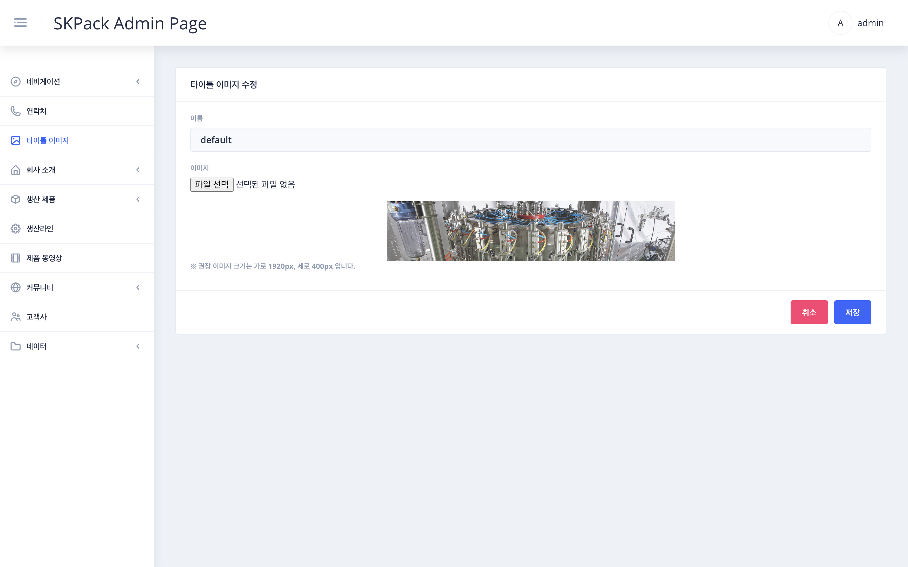
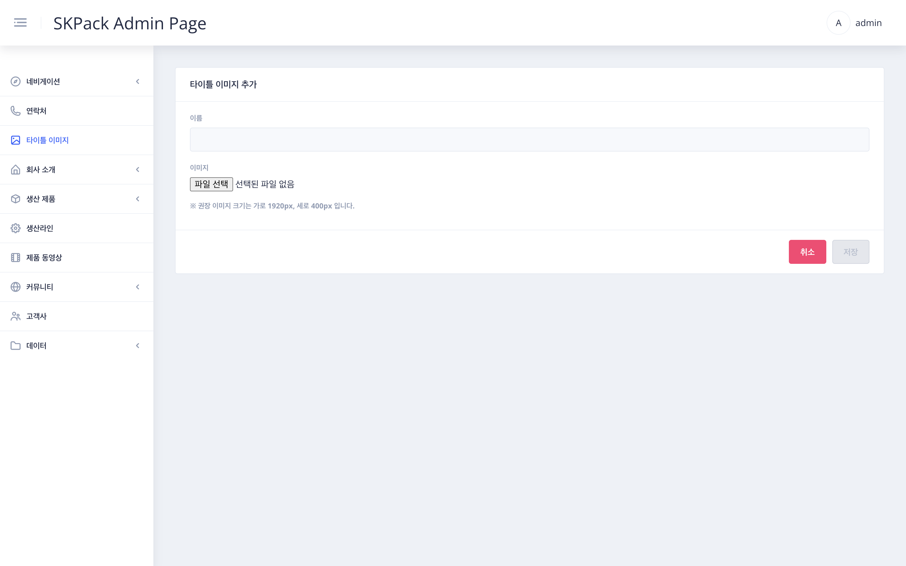

| SKPACK홈페이지 상단 타이틀 이미지 | 설명 |
  |:---:|:---:|
||<li>SKPACK 홈페이지의 최상단 타이틀 이미지입니다. <li> 이미지의 편집과 추가만 할수 있는 항목으로 실제 해당페이지에 이미지로 적용하기 위해서는 이곳에서 이미지파일을 업로드 후 좌측메뉴의 해당페이지에서 편집이나 추가등 업로드한 이미지 선택 해야 해당페이지에 적용됩니다. |
| 관리자 페이지 좌측메뉴 > `타이틀 이미지` 화면 | 설명 |
||<li>현재 설정되어있는 해당페이지 이름과 이미지 리스트들이 보여집니다.|
| 편집시: 편집할 항목 우측 `편집` > 메뉴 수정 화면 | 설명 |
|| 1. 이름은 영문으로 기존의 이름들과 겹치지않게 수정하여 줍니다. 디폴트 이미지는 따로 지정하지 않았을때 보여지게 될 기본 이미지입니다.    2. 파일선택을 눌러 이미지를 불러온 후 우측 하단`저장` 버튼을 눌러 작업을 완료합니다.|
| 이미지 추가시: 화면 우측 하단 `새 타이틀 이미지` > 메뉴 추가 화면 | 설명 |
|| 1. 이름은 영문으로 기존의 이름들과 겹치지않게 작성하여 줍니다.    3. 파일선택을 눌러 새 이미지를 불러온 후 우측 하단`저장` 버튼을 눌러 작업을 완료합니다.|

  